# **IntentsDB Website**

## Introduction
This is the repository for **IntentsDB** website.
The deployed version of the website can be found [here](https://milestone3-lily.herokuapp.com/). 
The purpose of this website is to provide a place where users can add, read, edit, and delete (CRUD) content of intents, 
descriptions, example utterances, entity names and entity values in terms of 
[Natural Language Understanding (NLU)](https://en.wikipedia.org/wiki/Natural-language_understanding) development. 
Users should already have knowledge and experiences of NLU development, 
for instance working on one's own NLU project or in a company project; 
and hence only a brief explaination about NLU is stated on the homepage. 
The data is stored in MongoDB database and can be simply retrieve and send through the frontend user interface. 
At the moment, only the administrator (login as "admin") can delete the data. Pease register as "<strong>admin</strong>" with a password of your choice for milestone project accessment.
The website is responsive and the users can navigate through the website in desktop and mobile devices.

## User Stories
1. As a user, I want to be able to navigate the website smoothly.
2. As a user, I want to know what is the website about.
3. As a user, I want to know how to use this website.
4. As a user, I want to be able to register myself
5. As a user, I want to be able to log in to the website
6. As a user, I want to be able to add, read, edit, and delete data from the database.
7. As a user, I want to have a double confirmation before deleting any data.
8. As a user, I want to be able to search the content of data via keywords.
9. As a user, I want to be able to log out to the website.

## Design
1. The [image of Alexa device](https://unsplash.com/photos/39MVKfRm3TA) downloaded from [Unsplash](https://unsplash.com/) is used on the mobile slide menu to represent where Natural Language Understanding (NLU) is used. 

2. Geometry of circles and rectangles (card-panels) are used through out the website to convey a simple impression.
3. Blue and green colors (<strong style="color:#1a237e">indigo darken-4</strong>, <strong style="color:#03a9f4">light-blue</strong>, and <strong style="color:#26a69a">teal lighten-1</strong>) are used through out the website and can be found in [materialize.css](https://materializecss.com/color.html) are used. Only one color of <strong style="color:red">red</strong> is used on the home page to catch user's attention.

## Wireframe
Balsamiq Wireframes was used to create the the skeleton plane, which can be found found [here](wireframe.md).

## Features
1. Navigation bar
    - it can be found on the top of the screen, when in mobile view, the navigation bar becomes mobile slide navbar hamburger menu on the left top of the screen. When the user clicks on the hamburger menu icon, a menu slides and appears from the left side of the screen. 
    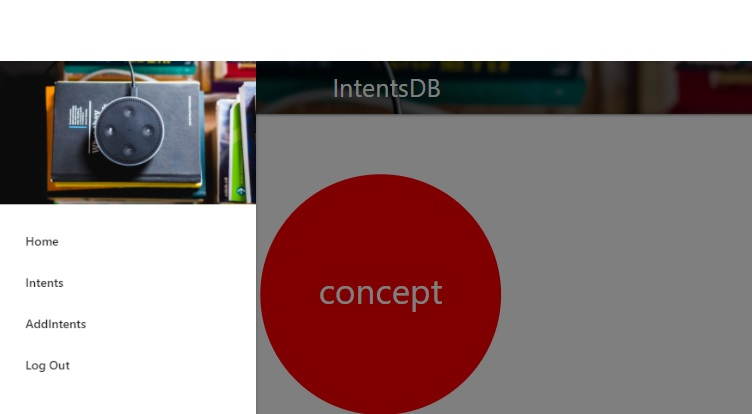 

    - Before login, users can only see "Home" and "Log In" on the navigation bar.
    - After login, users can then see "Home", "Intents", "Addintents", and "Logout" options once login.
    - The logo "IntentsDB" functions as the homepage anchor as well.

2. Login
    - Users can log in by clicking on "Log In" either in the navbar or on the footer.
    - After login, the page is directed to the home page with a flash messages of "Hello, {username}!". The place holder {username} is filled with the valid value of username found in MongoDB. 
    - If the user has a wrong username or password, a flash message appears to remind the user.

3. Register
     - If a new user wishes to register an account, one can click on "REGISTER". A register form appers on the right bottom corner. 
    
        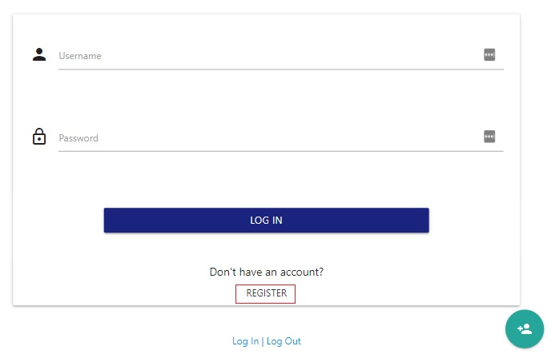
        
    

    - If the user already has an account, a flash messages of "already registered" appears to remind the user to log in.
    - After register, the page is directed to the home page with a flash messages of "you are now registered".

3. Intents
    - Users can see a list of intents that were saved previously.
    - Users can keywords search the data by typing any keywords without minimal length in the search input field and click on the "SEARCH" button.
    - Users can reset the entered keywords by clicking on the "RESET" button. 
    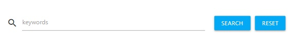 
    
    - If a keyword is not found, a flash message of "no result" is shown on the top of the screen. Click on "RESET" to go back to the "Intents" page. 
     

    - When user click on the intent name, a card panel pops out to show the details of the data, including description, example, entity name and entity value.
    
        
        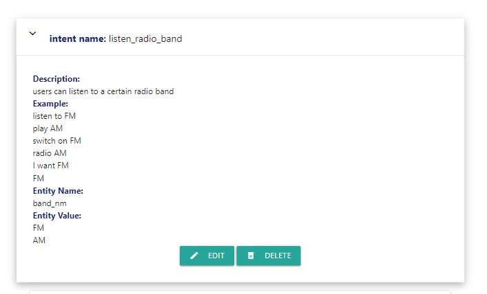
    
    - As users, you can edit the intent by clicking "EDIT" button. However, the "DELETE" button is deactivated. 
    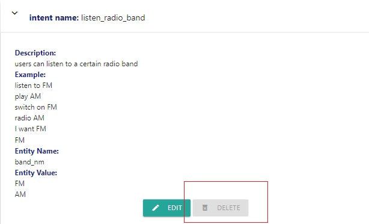 
    
    - As "admin", you can edit the intent by clicking "EDIT" button and delete the intent by click on the "DELETE" button. 
    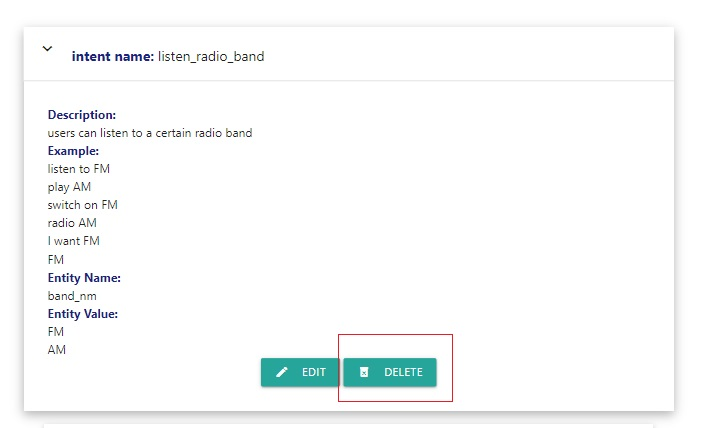 
    
    - A window will pop out once clicking on the "DELETE" button to ask for confirmation of deleting the specific intent. Admin can either select "NO" or "DELETE". 
    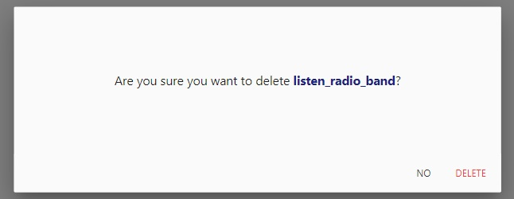 
    
    - After deletion, the page is directed to the "Intents" page with a list of intents except for the one which is just removed.

4. EditIntents
    - Users can edit intents on "EditIntents" with 
        - a mandatory intent name
        - a mandatory description
        - five mandatory example utterances
        - optional entity name
        - optional entity values
    - After submitting the edited data by clicking "DONE", the page stays on "AddIntents" page for the user to double check the result.
    - A flash message "intent updated" is shown on the same page once the intent is successfully updated.
    - If the users is satisfied with the edition, click on "INTENTS" to go back to the "Intents" page, where the edition is also modified in the list of intents.

5. AddIntents
    - In AddIntents page, a user can each time add
        - a mandatory new intent, which requires minimum five characters to maximum thirty-five characters. 
        - a mandatory description.
        - ten example utterances, in which five are mandatory.
        - three entity names, which are not mandatory.
        - ten entity values, which are not mandatory.
    - Each value in the input fileds is sent and stored to MongoDB database. 
    - After submit by clicking "SUBMIT" button, the page is directed to "Intents" page, where a user can see the updated list of intents, including the one that was just added to the database.
    - A flash message "intent added" is shown on the "Intents" page once the intent is successfully added.
6. LogOut
    - Users can logout anytime by clicking on "Log Out" either in the navbar or on the footer.
    - Users are directed to the homepage with a flash message "logged out" once logged one out.

7. Page Not found
    - Page-not-found page is directed when a user is searching for a non-exisiting landing page.  
    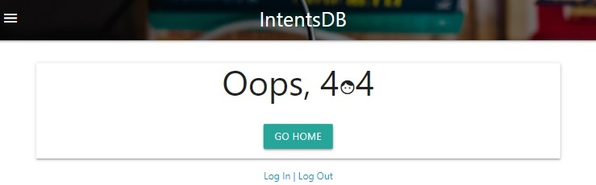 

    - Users can click on "GO HOME" button to be directed back to the home page.

## Development Tools
### Languages
1. Frontend languages are used through out the website.
    - HTML
    - CSS
    - jQuery is used in
        - sidenav
        - fadeOut
        - fadeIn
        - collapsible
        - modal
        - tapTarget
        - floatingActionButton
     
2. Backend langugage is used through out the website.
    - Python is used in
        - setting up the application environment
        - importing python libraries and framework
        - connecting to MongoDB database
        - creating landing pages
        - creating different functions
            - home function
            - login function
            - register function
            - logout function
            - intents function
            - search function
            - add_intent function
            - edit_intent function
            - delete_intent function
            - page_not_found function

### Libraries
1. [Materialize](https://materializecss.com/): Materialize classes and icons are widely used, especially the grid classes to make responsive website.
2. [jQuery](https://jquery.com/): it is used to allow the users to have interactive experiences. 
3. [Python](https://www.python.org/) libraries and framework of
    - [Flask](https://flask.palletsprojects.com/en/1.1.x/) web framwork
    - [Flask-PyMongo](https://flask-pymongo.readthedocs.io/en/latest/) to add methods to MongoDB Collection
    - [bson.objectid](https://pymongo.readthedocs.io/en/stable/api/bson/index.html) to identify IDs in MongoDB
    - [werkzeug.security](https://werkzeug.palletsprojects.com/en/1.0.x/utils/) to use generate_password_hash and check_password_hash

### Other
1. [Balsamiq Wireframes](https://balsamiq.com/) is used to design the wireframe of the website.
2. [Unsplash](https://unsplash.com/) is used to download an [image of Alexa device](https://unsplash.com/photos/39MVKfRm3TA).
3. [RandomKeygen](https://randomkeygen.com/) is used to generate a random secret key.
4. [GitHub](https://github.com/) is used to store the codes.
5. [Gitpod](https://gitpod.io/workspaces/) is used to write, add, commit, and push the codes to the GitHub repository by using git commands. The temporary preview browswer of the website is also used here.
6. [MongoDB](https://www.mongodb.com/) is used to store the data where the methods of "GET" and "POST" on the frontend user interface can connect to.
7. [Heroku](https://dashboard.heroku.com/) is used to connect to GitHub repository and deploy the website automatically.

## Testing
Testing details can be found [here](testing.md).

## Database
1. Log into MongoDB, click on "Create Database".
2. Enter database name and collection name.
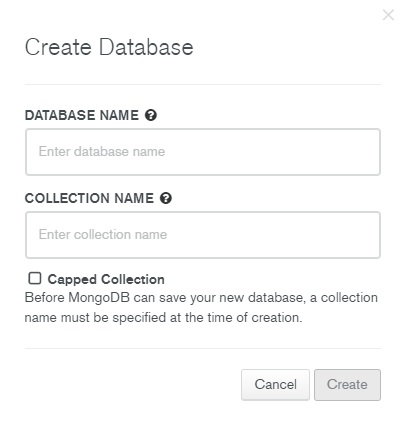 
3. Enter the collection and click on "INSERT DOCUMENT" to insert the initial data.
4. To connect the web application, click on "CONNECT" inside "SANDBOX".
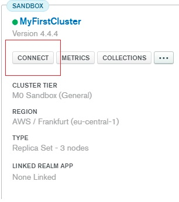 
5. Click on "Connect your application". 
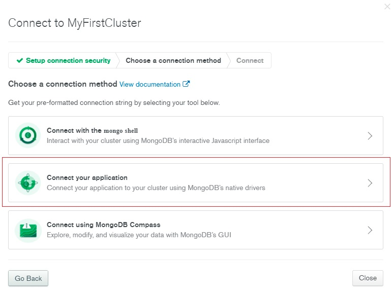 
6. Select DRIVER and VERSION.
7. Replace the password placeholder in the connection string and copy to the environment file. 
   mongodb+srv://lilychuang78:<password>@myfirstcluster.oqsvj.mongodb.net/myFirstDatabase?retryWrites=true&w=majority

## Deployment
1. Log into Heroku, click on the created app called "milestone3-lily".
2. Go to the "Setting" tab. 
 

3. Go to "Config Vars", click on "Reveal Config Vars". 
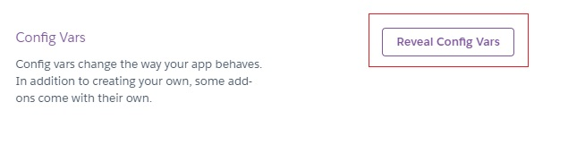 

4. Enter the respective key and values from env.py in the fileds. 
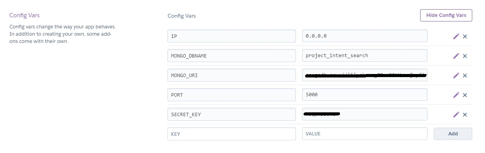 

5. Go to "Deploy" tab and select "GitHub" in "Deployment method". 
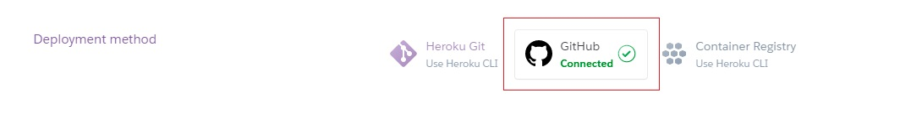 

6. In "Manual deploy", select the branch to deploy and click on "Deploy Branch". 
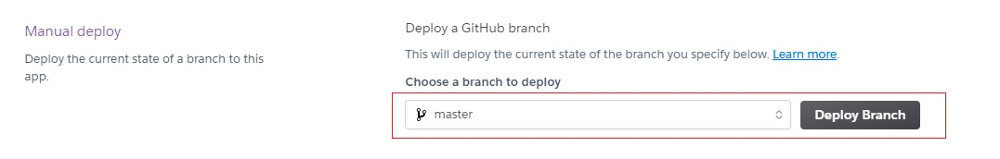 

7. After successfully deployed, one is able to receive the message of "Your app was successfully deployed". Click on "View" to see the deployed website. 
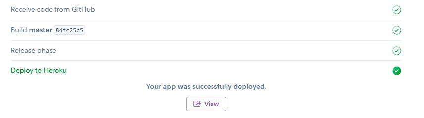 

## Credit
1. The inspiration and the functions of this project are learned from the lesson of [Mini Project | Putting It All Together](https://learn.codeinstitute.net/courses/course-v1:CodeInstitute+DCP101+2017_T3/courseware/9e2f12f5584e48acb3c29e9b0d7cc4fe/054c3813e82e4195b5a4d8cd8a99ebaa/) taught by [Code Institue](https://codeinstitute.net/).
2. The codes of [navbar](https://materializecss.com/navbar.html), [mobile navbar](https://materializecss.com/navbar.html), [collapsible](https://materializecss.com/collapsible.html), [model](https://materializecss.com/modals.html), and [tab target](https://materializecss.com/feature-discovery.html) are taken from [Materialize](https://materializecss.com/) and modified according to the specific case.
2. The [image of Alexa device](https://unsplash.com/photos/39MVKfRm3TA) is taken by Andres Urena.
3. I also want to thank Code Institute online tutors and my mentor Spencer for the technical help and ideas.