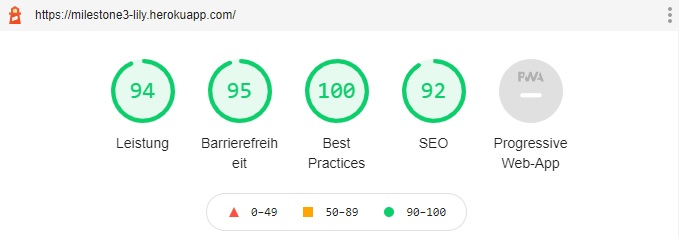
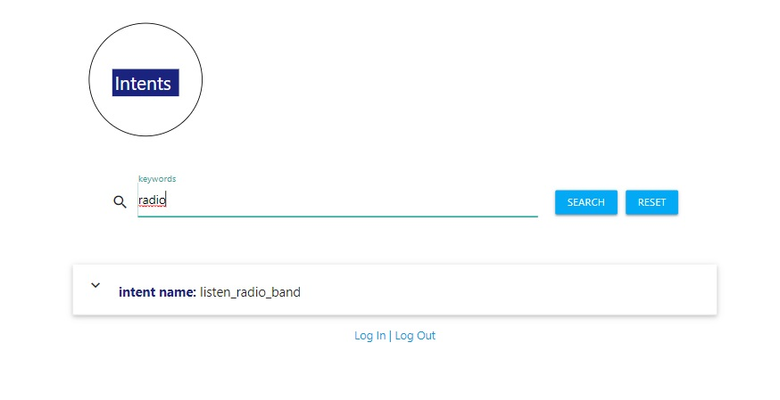
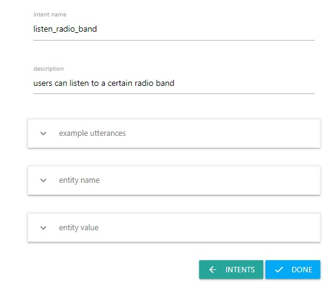
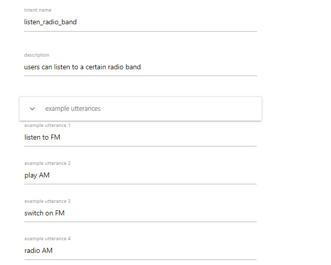

## Testing
1. [W3C Markup Validation Service](https://validator.w3.org/) is used to examine whether there is any HTML and CSS syntax error with "input by text" option.
2. [Google Chrome Developer Tool](https://developers.google.com/web/tools/chrome-devtools), including the console, is used to temporarily test and develop the website.
3. User Stories
    - As a user, I can get the concept and method of how to use the website by reading the homepage.
    - As a user, I can go to homepage and login page before login.
    - As a user, I can login with an username and a password without any issues.
    - As a user, I can navigate to different pages via navigation bar after login.
    - As a new user, I can register a new account by entering an username and a password.
    - As a user, I can search for an intent content by entering a keyword in the search field.
    - As a user, I can click the intent name to expand the contents of the intent.
    - As a user, I can edit the intent content by clicking on the "EDIT" button.
    - As a user, I can navigate "AddIntents" page, enter the intent content, and click the "SUBMIT" button. 
    The page is re-direct to the "Intents" page and I can see the updated result on the "Intents" page.
    - As a user (admin), I can get a double confirmation before deleting any data.
    - As a user (admin), I can delete the data without any issues.
    - As a user (admin), I can also go back to the page without deleting any data.
    - As a user, I can log out the website without any issues.

4. Lighthouse in Google Chrome Developer Tool Chrome is used to test the accessibility and performance.

5. Reponsive design in the below devices is tesed with Google Chrome Developer Tool. 
   - Moto G4, Galaxy S5, Pixel 2, Pixel 2 XL, iPhone 5/SE, iPhone 6/7/8, iPhone 6/7/8 Plus, iPhone X, iPad, iPad Pro, 
   Surface Duo, Galxy Fold, DELL Laptop Latitude 5490 
6. Manual Testing
    - Navigation bar:
        - Each anchor can direct to the correspondant page successfully.
        - The logo of "IntentsDB" funcions as the homepage anchor as well as the "Home" anchor. It directs to the homepage.
    
    - Register:
        - I am able to open the register form by clicking on "REGISTER".
        - I can enter a username and password to register. The user appears also in MongoDB database.
        - A flash message appears to indicate if I registered already or successfully registered.
    
    - Log in
        - I can enter a username and password to login.
        - A flash message appears if I entered the wrong username or password.
        - A flash message of greeting also appears if I log in successfully.
    
    - Log out
        - I can log out without any issues.
        - A flash message indicates I have logged out appears.
    
    - Expired session
        - When I attempt to access the intent database via the link of http://milestone3-lily.herokuapp.com/intents or http://milestone3-lily.herokuapp.com/add_intent, 
          the page remains on the homepage or directs to the homepage (if it was on the "Log In" page). I see a flash message of "you are not logged in".
        
    - <strong>CRUD</strong>
        - READ:
            - I am able to click on the intent name and a window pops out where I can see not only the intent name but aslo the description, example utterances, entity name, and entity value on the "Intents" page.
             - I am able search an intent content by entering the keyword, and click on "SEARCH" button. 
            
            - I am able to reset the keyword search by clicking the "RESET" button, and am directed to the "Intents" page, where a list of intents are displayed.

        - EDIT:
            - I am able to edit the intent content by click on the "EDIT" button, and am directed to the "EditIntents" page.
            - I am able to edit the intent content 
            - When there are several fields under the same key names (example utterances, entity name, and entity value), I can click and expand the multiple fields in order to modify the input. 
            
            

            - I am able to submit the updated intent content by clicking on the "DONE" button. The page remains but with the updated version, so I can decide if there is further modification.
            - I am able to go to the "Intents" page by clicking on the "INTENTS" button.

        - ADD:
            - I am go to add intent content by clicking on "AddIntents" on the navbar.
            - I am able to enter one intent name, description, at least five example utterances, entity name, and entity value in the input fields.
            - When there are several fields under the same key names (example utterances, entity name, and entity value), I can click and expand the multiple fields in order to enter the input.
            - After clicking on "SUBMIT" button, the page is directed to "Intents" page with the updated list of intent content.
        
        - DELETE:
            - As a <strong>admin</strong>, I can click on the "DELETE" button.
            - Before the deletion, I can see a window pops out to double confirm whether I want to delete the selected intent (with the intent name specified).
            - I can either remove the intent after confirmation or decide not to.
            - If I decide not to remove the intent content, the page stays on the "Intents" page.
